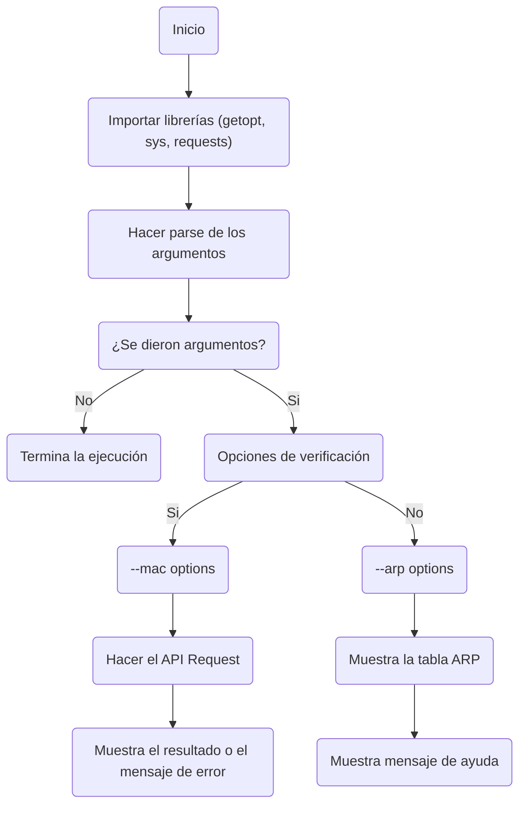

# OUILookup - Tarea 2

Integrantes del equipo:

- Diana Paola Narváez Martínez: dianapa.narvaez@gmail.com
- Diego Ruan Padilla: ruan.padilla.diego@gmail.com
- Bruno Guerra Uteau: guerrauteaub@gmail.com

## Instalación

Clona el repositorio en terminal mediante los siguientes comandos:

```bash
git clone https://github.com/dixnne/OUILookup.git
cd OUILookup
chmod +x OUILookup.py
```

Podría ser necesario instalar la librería *requests* de python:

```bash
pip3 install requests
```

## Uso

```bash
python3 OUILookup.py [-a,-m {aa:bb:cc...}]
```

## Diagrama de flujo de la solución


